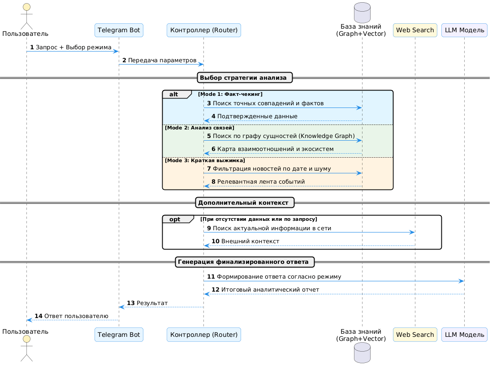

#  GraphRAG News Analytics System

**GraphRAG News Analytics** — это высокотехнологичная экосистема для автоматизированного сбора, структурирования и глубокого анализа новостного контента из Telegram. Система объединяет мощь графовых знаний (**Neo4j**) и семантического поиска (**Qdrant**), предоставляя аналитику через интерфейс Telegram-бота.

---

##  Архитектура системы (Technical Overview)

Проект построен на принципах **Hybrid RAG**, что позволяет отвечать не только на вопросы "Что произошло?", но и "Почему это произошло и как это связано с другими событиями?".

### 1. Tri-Database Strategy (Гибридное хранение)
Для обеспечения максимальной глубины анализа используются три типа баз данных:
*   **Graph DB (Neo4j):** Хранение извлеченных сущностей (Entity) и их взаимосвязей (Relationship). Используется для выявления косвенных влияний и построения логических цепочек.
*   **Vector DB (Qdrant):** Семантический поиск по смысловым сегментам (Chunk) новостей с использованием эмбеддингов `multilingual-e5-base`.
*   **Relational DB (PostgreSQL):** Управление метаданными, статусами каналов и историей обработки данных (ETL-состояния).

### 2. Интеллектуальный ETL-пайплайн (Orchestration)
Процесс обработки данных полностью автоматизирован через **Apache Airflow**:
1.  **Ingestion:** Асинхронный скрапинг через MTProto (Telegram API).
2.  **Processing:** Разбиение текстов на чанки с сохранением контекста.
3.  **Extraction (LLM + LangGraph):** Многостадийная экстракция сущностей и связей с использованием Gemini/Gemma 3. Реализована логика "синтеза связей" между разными новостями одного временного окна.
4.  **Embedding & Indexing:** Параллельная запись в Neo4j и Qdrant.

### 3. Сетевая устойчивость (Sidecar Proxy)
Система спроектирована как автономный "черный ящик". Для обхода региональных ограничений Gemini API в Docker-окружение интегрирован **Sidecar Proxy (Xray/VLESS)**. Весь LLM-трафик автоматически маршрутизируется через защищенный шлюз.

---

##  Визуальная документация

Для наглядного понимания архитектурных решений ниже представлены UML-диаграммы:

### 1. Архитектура режимов поиска (AI Search Modes)
Данная схема описывает логику маршрутизации запросов пользователя и процесс взаимодействия сервиса с векторным и графовым хранилищами.


### 2. Пайплайн обработки данных (ETL Pipeline)
Визуализация процесса сбора новостей, их трансформации в знания и индексации в Tri-DB контуре.


---

## Режимы аналитического взаимодействия

Система поддерживает три специализированных режима работы (Core Engine):

| Режим | Технология | Описание |
| :--- | :--- | :--- |
| **Mode 1: Fact Check** | Gemini Flash | Быстрый поиск конкретных фактов в локальной базе знаний. |
| **Mode 2: Deep Analysis** | Gemma 3 12b | Трансверсальный анализ. Поиск скрытых причинно-следственных связей через обход графа. |
| **Mode 3: News Digest** | Gemma 3 12b | Генерация тематических сводок. Реализован алгоритм **Sector Lockdown** — жесткая фильтрация рыночного "шума". |

*Дополнительно реализован **Web Search Fallback**: если локальной информации недостаточно, система выполняет поиск через Tavily API для актуализации данных из глобальной сети.*

---

##  MLOps и Телеметрия (Observability)

Проект включает в себя полноценный контур мониторинга:
*   **MLflow:** Трекинг всех запросов, контекстов и ответов для аудита "галлюцинаций".
*   **Prometheus & Grafana:** Мониторинг RPM/TPM, времени инференса и бизнес-метрик.

---

##  Технологический стек

*   **Backend:** Python 3.11, AIOGram 3, LangChain & LangGraph.
*   **Storage:** Neo4j (Cypher), Qdrant (Vector), PostgreSQL.
*   **Infrastructure:** Docker Compose, Apache Airflow, Xray Proxy.
*   **Monitoring:** MLflow, Prometheus, Grafana.

---

##  Быстрый старт

1.  Настройте файлы конфигурации `.env.db` и `.env.scraper` (на основе шаблонов).
2.  Запустите систему:
    ```bash
    docker-compose up -d
    ```
3.  Инициализируйте Airflow (через дашборд на порту 8080).
